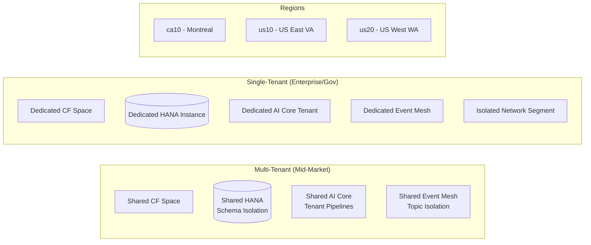
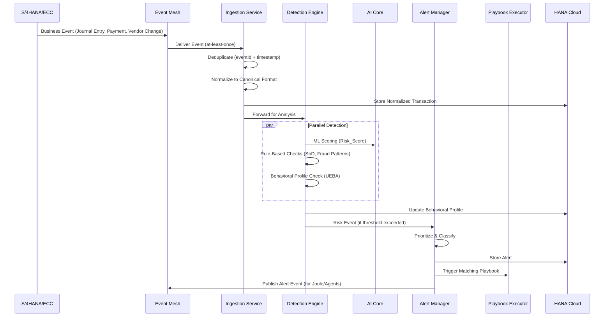

# Design Document: FinSecure AI

## Overview

FinSecure AI is an AI-powered Financial Transaction Risk Intelligence and Application Security platform built on SAP BTP Cloud Foundry. The system provides unified security monitoring for S/4HANA Cloud Private Edition, S/4HANA On-Premise, and SAP ECC 6.0 environments, delivering real-time anomaly detection, UEBA, SoD violation detection, fraud pattern recognition, IAM monitoring, vulnerability scanning, privilege escalation detection, insider threat identification, and multi-framework compliance dashboards.

### Design Principles

1. **Event-Driven Architecture**: All threat detection is asynchronous via SAP Event Mesh, guaranteeing zero performance impact on source SAP systems
2. **Tenant Isolation**: Schema-level isolation in HANA Cloud with tenant-scoped credentials, ML models, and configuration
3. **SAP-Native Stack**: Exclusively SAP-certified components (CAP Node.js, HANA Cloud, Fiori Elements, Integration Suite, AI Core, Event Mesh, IAS/XSUAA) for SAP Store eligibility
4. **ML-First Detection**: Tenant-specific models trained on SAP AI Core with continuous improvement from analyst feedback
5. **Defense in Depth**: Data classification, field-level masking, RBAC, MFA, and audit logging at every layer
6. **Horizontal Scalability**: Event consumers scale independently per tenant from 1-10 instances based on volume

### Key Design Decisions

| Decision | Choice | Rationale |
|----------|--------|-----------|
| Application Framework | CAP Node.js | SAP Store mandate; built-in multi-tenancy, OData, HANA integration |
| Database | SAP HANA Cloud | In-memory analytics for real-time dashboards; vector store for RAG |
| ML Platform | SAP AI Core | SAP-certified; tenant-isolated training pipelines; GenAI Hub access |
| Event Bus | SAP Event Mesh | Asynchronous processing; guaranteed delivery; native BTP integration |
| UI Framework | Fiori Elements + Custom Extensions | SAP Store compliance; metadata-driven with extensions for SOC views |
| Authentication | IAS + XSUAA | Principal propagation to back-end SAP; MFA enforcement |
| Integration | SAP Integration Suite | Pre-built content packs; Cloud Connector for on-premise systems |
| GenAI Access | SAP Generative AI Hub | Foundation models within BTP security boundary; data residency |
| Deployment | MTA on CF | Standard SAP BTP packaging; declarative service dependencies |

---

## Architecture

### High-Level System Architecture

```mermaid
graph TB
    subgraph "External Systems"
        S4HC[S/4HANA Cloud PE]
        S4OP[S/4HANA On-Premise]
        ECC[SAP ECC 6.0]
        SF[SuccessFactors HCM]
        CVA[Code Vulnerability Analyzer]
        IDP[Corporate IdP<br/>Entra ID / Okta / Ping]
    end

    subgraph "SAP BTP Cloud Foundry"
        subgraph "Edge Layer"
            IAS[SAP IAS]
            XSUAA[XSUAA]
            BWZ[SAP Build Work Zone]
        end

        subgraph "Application Layer - CAP Node.js"
            API[OData V4 Services]
            TM[Tenant Manager]
            ING[Ingestion Service]
            DET[Detection Engine]
            ALR[Alert Manager]
            INV[Investigation Service]
            PBK[Playbook Executor]
            CMP[Compliance Engine]
            RPT[Report Generator]
            IAM[IAM Monitor]
            VSC[Vulnerability Scanner]
            AGT[Agent Extension API]
        end

        subgraph "AI/ML Layer"
            AIC[SAP AI Core]
            GAI[Generative AI Hub]
            RAG[RAG Pipeline]
            JOULE[Joule Agent]
        end

        subgraph "Data Layer"
            HANA[(SAP HANA Cloud<br/>Tenant Schemas)]
            VEC[(HANA Vector Store)]
            CRED[Credential Store]
        end

        subgraph "Event Layer"
            EM[SAP Event Mesh]
            DLQ[Dead Letter Queue]
        end

        subgraph "Integration Layer"
            IS[SAP Integration Suite]
            CC[Cloud Connector]
        end

        subgraph "Platform Services"
            SPS[SaaS Provisioning]
            ALS[Audit Log Service]
            ANS[Alert Notification Service]
        end
    end

    subgraph "UI Layer"
        FE[Fiori Elements Apps]
        CMD[Command Center<br/>Custom Extension]
        GEO[Geographic View<br/>Custom Extension]
    end

    %% Authentication Flow
    IDP --> IAS
    IAS --> XSUAA
    XSUAA --> API

    %% UI Access
    BWZ --> FE
    BWZ --> CMD
    BWZ --> GEO
    BWZ --> JOULE
    FE --> API

    %% Data Ingestion
    S4HC -->|Event Mesh| EM
    S4HC -->|OData V4| IS
    S4OP -->|RFC/OData/SOAP| CC
    ECC -->|BAPI/RFC/IDoc| CC
    SF -->|Integration Suite| IS
    CVA -->|Integration Suite| IS
    CC --> IS
    IS --> ING

    %% Event Processing
    EM --> ING
    ING --> DET
    DET --> ALR
    ALR --> PBK
    ALR --> ANS

    %% AI/ML
    DET --> AIC
    ALR --> GAI
    RAG --> VEC
    GAI --> RAG
    JOULE --> API
    JOULE --> GAI

    %% Data Storage
    API --> HANA
    DET --> HANA
    ALR --> HANA
    ING --> HANA
    API --> ALS

    %% Agent Extension
    AGT --> EM
    AGT --> HANA
```



### Deployment Architecture



### Event Processing Pipeline



---

## Components and Interfaces

### 1. Tenant Manager Service

**Responsibility**: Handles tenant lifecycle (provisioning, configuration, deletion) via SAP SaaS Provisioning Service callbacks.

```typescript
// srv/tenant-manager/tenant-manager-service.ts

interface TenantConfig {
  tenantId: string;
  subdomain: string;
  region: 'ca10' | 'us10' | 'us20';
  deploymentModel: 'multi-tenant' | 'single-tenant';
  connectedSystems: SystemRegistration[];
  compliancePacks: CompliancePackId[];
  thresholds: TenantThresholds;
}

interface SystemRegistration {
  systemId: string;
  systemType: 'S4HC' | 'S4OP' | 'ECC';
  release: string;
  connectionConfig: ConnectionConfig;
  monitoringScope: MonitoringScope;
}

interface TenantThresholds {
  riskScoreAlertThreshold: number;       // 1-99, default 70
  behavioralSensitivity: number;         // 1-10, default 5
  sodLookbackDays: number;               // 1-365, default 90
  vendorBankChangeHours: number;         // 1-720, default 48
  dormantAccountDays: number;            // default 90
  roundNumberThreshold: number;          // default 10000
  dormancyPeriodDays: number;            // default 180
  businessHoursStart: number;            // 0-23
  businessHoursEnd: number;              // 0-23
  paymentFlagThreshold: number;          // default 70
  paymentAmountFactor: number;           // default 3
  massDataRecordLimit: number;           // default 10000
  massDataVolumeLimit: number;           // default 50MB
  maxFirefighterHours: number;           // 1-72, default 8
  threeWayMatchTolerance: number;        // default 0.02 (2%)
  grirClearingDays: number;              // 7-180, default 30
}

// CAP Service Definition
class TenantManagerService extends cds.ApplicationService {
  /**
   * SaaS Provisioning callback: provision new tenant
   * Creates HANA schema, registers in tenant registry, provisions AI Core pipeline
   * Must complete within 300 seconds or rollback
   */
  async onSubscribe(tenantId: string, payload: SubscriptionPayload): Promise<string>;

  /**
   * SaaS Provisioning callback: deprovision tenant
   * Removes all tenant data, credentials, ML models within 72 hours
   */
  async onUnsubscribe(tenantId: string): Promise<void>;

  /**
   * Register a connected SAP system for a tenant
   * Stores credentials in Credential Store with tenant-scoped namespace
   */
  async registerSystem(tenantId: string, config: SystemRegistration): Promise<void>;

  /**
   * Activate/deactivate compliance packs for a tenant
   */
  async manageCompliancePacks(tenantId: string, packs: CompliancePackId[]): Promise<void>;

  /**
   * Update tenant-specific thresholds
   */
  async updateThresholds(tenantId: string, thresholds: Partial<TenantThresholds>): Promise<void>;
}
```

### 2. Ingestion Service

**Responsibility**: Receives events from Event Mesh and batch data from Integration Suite, normalizes to canonical format, deduplicates, and forwards to Detection Engine.

```typescript
// srv/ingestion/ingestion-service.ts

interface CanonicalTransaction {
  transactionId: string;           // Unique internal ID
  tenantId: string;
  sourceSystem: string;            // System registration ID
  sourceEventId: string;           // Original event ID for dedup
  documentNumber: string;
  documentType: DocumentType;
  postingDate: Date;
  entryDate: Date;
  amount: number;
  currency: string;
  userId: string;                  // SAP user who posted
  companyCode: string;
  debitAccount: string;
  creditAccount: string;
  costCenter?: string;
  vendorId?: string;
  businessObjectRef: string;       // Reference to source business object
  metadata: Record<string, any>;   // Additional fields per document type
  ingestedAt: Date;
  normalizedAt: Date;
}

type DocumentType = 
  | 'JOURNAL_ENTRY'
  | 'PAYMENT_DOCUMENT'
  | 'VENDOR_MASTER_CHANGE'
  | 'GOODS_RECEIPT'
  | 'INVOICE_RECEIPT'
  | 'PURCHASE_ORDER'
  | 'ROLE_ASSIGNMENT'
  | 'AUTH_CHANGE'
  | 'TRANSPORT_IMPORT'
  | 'SECURITY_AUDIT_EVENT'
  | 'PARAMETER_CHANGE';

interface DeduplicationResult {
  isDuplicate: boolean;
  existingTransactionId?: string;
}

class IngestionService extends cds.ApplicationService {
  /**
   * Event Mesh handler: process real-time event
   * Normalizes within 5 seconds of receipt
   */
  async processEvent(event: RawSAPEvent): Promise<CanonicalTransaction>;

  /**
   * Batch synchronization: pull historical data via Integration Suite
   * Configurable schedule, default every 6 hours
   */
  async batchSync(tenantId: string, systemId: string, fromDate: Date): Promise<BatchResult>;

  /**
   * Deduplication check using eventId + timestamp composite key
   */
  async checkDuplicate(tenantId: string, sourceEventId: string, timestamp: Date): Promise<DeduplicationResult>;

  /**
   * Normalize raw SAP event to canonical format
   * Handles S/4HANA (OData), ECC (BAPI/RFC/IDoc) format differences
   */
  async normalize(raw: RawSAPEvent, systemType: SystemType): CanonicalTransaction;

  /**
   * Route unprocessable events to Dead Letter Queue
   */
  async routeToDeadLetterQueue(event: RawSAPEvent, reason: string): Promise<void>;
}
```

### 3. Detection Engine

**Responsibility**: Orchestrates all detection mechanisms (ML scoring, rule-based, behavioral analysis) and produces risk events.

```typescript
// srv/detection/detection-engine.ts

interface RiskEvent {
  riskEventId: string;
  tenantId: string;
  transactionId: string;
  riskCategory: RiskCategory;
  riskScore: number;              // 0-100
  confidence: number;             // 0-100 (ML model confidence)
  detectionMethod: DetectionMethod;
  riskIndicators: RiskIndicator[];
  affectedEntities: AffectedEntity[];
  financialExposure?: number;
  detectedAt: Date;
}

type RiskCategory =
  | 'ANOMALY'
  | 'SOD_VIOLATION'
  | 'FRAUD_PATTERN'
  | 'IAM_VIOLATION'
  | 'PRIVILEGE_ESCALATION'
  | 'INSIDER_THREAT'
  | 'COMPLIANCE_BREACH'
  | 'VULNERABILITY'
  | 'VENDOR_TAMPERING'
  | 'P2P_CONTROL_GAP';

type DetectionMethod = 
  | 'ML_SCORING'
  | 'RULE_BASED'
  | 'BEHAVIORAL_DEVIATION'
  | 'PATTERN_MATCHING'
  | 'CORRELATION'
  | 'THRESHOLD_BREACH';

interface RiskIndicator {
  indicatorType: string;
  description: string;
  observedValue: any;
  expectedRange?: { min: any; max: any };
  weight: number;
}

class DetectionEngine extends cds.ApplicationService {
  /**
   * Main entry point: analyze a normalized transaction
   * Orchestrates ML scoring + rule checks + behavioral analysis in parallel
   * Must complete within 10 seconds of ingestion
   */
  async analyzeTransaction(tx: CanonicalTransaction): Promise<RiskEvent[]>;

  /**
   * ML-based anomaly scoring via AI Core
   */
  async scoreWithMLModel(tenantId: string, tx: CanonicalTransaction): Promise<MLScore>;

  /**
   * Rule-based SoD violation check
   */
  async checkSoDViolations(tenantId: string, tx: CanonicalTransaction): Promise<SoDViolation[]>;

  /**
   * Fraud pattern matching (duplicate payments, vendor bank manipulation, etc.)
   */
  async detectFraudPatterns(tenantId: string, tx: CanonicalTransaction): Promise<FraudMatch[]>;

  /**
   * Behavioral deviation analysis against user's profile
   */
  async checkBehavioralDeviation(tenantId: string, tx: CanonicalTransaction): Promise<BehavioralDeviation | null>;

  /**
   * Privilege escalation sequence detection
   */
  async detectPrivilegeEscalation(tenantId: string, tx: CanonicalTransaction): Promise<EscalationEvent | null>;

  /**
   * Insider threat indicator evaluation
   */
  async evaluateInsiderThreatIndicators(tenantId: string, tx: CanonicalTransaction): Promise<InsiderThreatIndicator[]>;

  /**
   * Payment run analysis: score all payments in a run within 60 seconds
   */
  async analyzePaymentRun(tenantId: string, paymentRun: PaymentRunEvent): Promise<PaymentRunAnalysis>;

  /**
   * Vendor master tampering correlation
   */
  async correlateVendorBankChange(tenantId: string, vendorChange: VendorChangeEvent): Promise<VendorRiskAssessment>;
}
```

### 4. UEBA Engine

**Responsibility**: Maintains behavioral profiles and detects deviations.

```typescript
// srv/detection/ueba-engine.ts

interface BehavioralProfile {
  profileId: string;
  tenantId: string;
  userId: string;
  status: 'LEARNING' | 'ACTIVE';
  windowStart: Date;
  windowEnd: Date;
  daysCovered: number;
  dimensions: BehavioralDimensions;
  lastUpdated: Date;
}

interface BehavioralDimensions {
  postingFrequency: {
    mean: number;
    stdDev: number;
    dailyCounts: number[];
  };
  postingTimes: {
    hourDistribution: number[];    // 24-element array, count per hour
    peakHours: number[];
  };
  accountCombinations: Set<string>; // "debit:credit" pairs
  transactionAmounts: {
    mean: number;
    stdDev: number;
    p90: number;
    p99: number;
  };
  costCenters: Set<string>;
  vendorRelationships: Set<string>;
  transactionCodes: Set<string>;   // For privilege escalation detection
  dataAccessVolume: {
    meanRecordsPerDay: number;
    stdDev: number;
    p90: number;
  };
}

interface BehavioralDeviation {
  userId: string;
  deviationDimension: keyof BehavioralDimensions;
  expectedRange: { min: number; max: number };
  observedValue: number;
  deviationMagnitude: number;      // Number of std deviations
  riskScore: number;
}

class UEBAEngine {
  /**
   * Build or update behavioral profile incrementally
   * Must complete within 5 minutes of ingestion
   */
  async updateProfile(tenantId: string, userId: string, tx: CanonicalTransaction): Promise<void>;

  /**
   * Check transaction against user's behavioral profile
   * Returns deviation if beyond sensitivity threshold
   */
  async checkDeviation(
    tenantId: string,
    userId: string,
    tx: CanonicalTransaction,
    sensitivity: number  // 1-10
  ): Promise<BehavioralDeviation | null>;

  /**
   * Calculate insider threat score from multiple dimensions
   */
  async calculateInsiderThreatScore(tenantId: string, userId: string): Promise<number>;

  /**
   * Elevate monitoring sensitivity for HR-correlated users
   */
  async applyHRRiskMultiplier(tenantId: string, userId: string, multiplier: number, durationDays: number): Promise<void>;

  /**
   * Get peer group baseline for access outlier detection
   */
  async getPeerGroupBaseline(tenantId: string, userId: string): Promise<PeerGroupMetrics>;
}
```

### 5. Alert Manager Service

**Responsibility**: Creates, prioritizes, delivers, and manages alert lifecycle.

```typescript
// srv/alerts/alert-manager-service.ts

interface Alert {
  alertId: string;
  tenantId: string;
  priority: 'CRITICAL' | 'HIGH' | 'MEDIUM' | 'LOW';
  status: 'OPEN' | 'IN_PROGRESS' | 'ESCALATED' | 'RESOLVED_TRUE_POSITIVE' | 'RESOLVED_FALSE_POSITIVE';
  riskCategory: RiskCategory;
  riskScore: number;
  financialExposure?: number;
  title: string;
  description: string;
  triggeringTransaction: CanonicalTransaction;
  riskIndicators: RiskIndicator[];
  affectedEntities: AffectedEntity[];
  recommendedActions: string[];
  assignedAnalyst?: string;
  aiSummary?: string;
  aiTriageRecommendation?: string;
  aiConfidenceScore?: number;
  clusterId?: string;
  createdAt: Date;
  updatedAt: Date;
  slaDeadline: Date;
  escalatedAt?: Date;
}

interface AlertPriorityRules {
  // critical if Risk_Score >= 90 OR financial exposure >= 1,000,000
  // high if Risk_Score >= 70 OR financial exposure >= 100,000
  // medium if Risk_Score >= 40
  // low otherwise
  criticalScoreThreshold: 90;
  criticalExposureThreshold: 1000000;
  highScoreThreshold: 70;
  highExposureThreshold: 100000;
  mediumScoreThreshold: 40;
}

// Valid state transitions
const VALID_TRANSITIONS: Record<string, string[]> = {
  'OPEN': ['IN_PROGRESS', 'ESCALATED'],
  'IN_PROGRESS': ['ESCALATED', 'RESOLVED_TRUE_POSITIVE', 'RESOLVED_FALSE_POSITIVE'],
  'ESCALATED': ['IN_PROGRESS', 'RESOLVED_TRUE_POSITIVE', 'RESOLVED_FALSE_POSITIVE'],
};

class AlertManagerService extends cds.ApplicationService {
  /**
   * Create alert from risk event with priority classification
   * Delivers within 60 seconds of generation
   */
  async createAlert(riskEvent: RiskEvent): Promise<Alert>;

  /**
   * Calculate priority based on risk score, category, and financial exposure
   */
  calculatePriority(riskScore: number, riskCategory: RiskCategory, financialExposure?: number): AlertPriority;

  /**
   * Deliver alert through configured channels (in-app, email, ANS push)
   */
  async deliverAlert(alert: Alert): Promise<void>;

  /**
   * Transition alert state with validation
   * Rejects invalid transitions
   */
  async transitionState(alertId: string, targetState: string, userId: string, notes?: string): Promise<Alert>;

  /**
   * Auto-escalate critical alerts exceeding SLA
   */
  async checkSLAEscalation(): Promise<void>;

  /**
   * AI-powered alert clustering
   */
  async clusterRelatedAlerts(tenantId: string, alert: Alert): Promise<string | null>;

  /**
   * Get related historical alerts for context
   */
  async getRelatedAlerts(alert: Alert, limit: number): Promise<Alert[]>;
}
```

### 6. Investigation Service

**Responsibility**: Manages the investigation workflow with full audit trail.

```typescript
// srv/investigations/investigation-service.ts

interface Investigation {
  investigationId: string;
  tenantId: string;
  alertId: string;
  status: 'OPEN' | 'IN_PROGRESS' | 'ESCALATED' | 'RESOLVED_TRUE_POSITIVE' | 'RESOLVED_FALSE_POSITIVE';
  assignedAnalyst: string;
  notes: InvestigationNote[];
  resolutionType?: string;
  resolutionNotes?: string;        // 1-5000 characters, mandatory on resolution
  aiInvestigationBrief?: string;
  relatedInvestigations: string[];
  evidencePackage: EvidenceItem[];
  startedAt: Date;
  resolvedAt?: Date;
  elapsedTime?: number;            // milliseconds
}

interface InvestigationNote {
  noteId: string;
  author: string;
  content: string;
  createdAt: Date;
  attachments?: string[];
}

class InvestigationService extends cds.ApplicationService {
  /**
   * Create investigation from alert
   */
  async createInvestigation(alertId: string, analystId: string): Promise<Investigation>;

  /**
   * Transition investigation state with validation
   */
  async transitionState(investigationId: string, targetState: string, userId: string): Promise<Investigation>;

  /**
   * Resolve investigation with mandatory notes
   */
  async resolve(investigationId: string, resolution: ResolutionPayload): Promise<Investigation>;

  /**
   * Generate AI investigation brief via GenAI Hub
   */
  async generateAIBrief(investigationId: string): Promise<string>;

  /**
   * Export evidence package as signed PDF
   */
  async exportEvidencePackage(investigationId: string): Promise<Buffer>;
}
```

### 7. Playbook Executor

**Responsibility**: Executes automated response playbooks triggered by alerts.

```typescript
// srv/playbooks/playbook-executor.ts

interface Playbook {
  playbookId: string;
  tenantId: string;
  name: string;
  triggerConditions: TriggerCondition[];
  steps: PlaybookStep[];         // Max 20 ordered steps
  requiresApproval: boolean;     // For high-impact containment actions
  approvalTimeout: number;       // Default 15 minutes
}

interface PlaybookStep {
  stepOrder: number;
  actionType: PlaybookActionType;
  parameters: Record<string, any>;
  timeout: number;               // Default 30 seconds
  onFailure: 'RETRY_ONCE' | 'HALT';
}

type PlaybookActionType =
  | 'BLOCK_PAYMENT'
  | 'NOTIFY_APPROVER_CHAIN'
  | 'CREATE_INCIDENT_TICKET'
  | 'REQUEST_ADDITIONAL_APPROVAL'
  | 'SEND_NOTIFICATION'
  | 'LOCK_USER_ACCOUNT'
  | 'REVOKE_ROLE'
  | 'ESCALATE_ALERT'
  | 'CUSTOM_API_CALL';

interface TriggerCondition {
  field: 'riskCategory' | 'priority' | 'riskScore' | 'entityType';
  operator: 'EQUALS' | 'GREATER_THAN' | 'IN';
  value: any;
}

class PlaybookExecutor extends cds.ApplicationService {
  /**
   * Evaluate if any playbook matches the alert
   * Execute within 60 seconds of alert generation
   */
  async evaluateAndExecute(alert: Alert): Promise<PlaybookExecution | null>;

  /**
   * Execute a single playbook step with timeout (30s default)
   */
  async executeStep(step: PlaybookStep, context: ExecutionContext): Promise<StepResult>;

  /**
   * Handle high-impact actions requiring approval
   * Wait up to 15 minutes for confirmation
   */
  async requestApproval(playbookId: string, action: PlaybookStep, alert: Alert): Promise<boolean>;

  /**
   * Queue execution when same playbook is already in progress for entity
   */
  async queueExecution(playbookId: string, entityId: string, alert: Alert): Promise<void>;
}
```

### 8. Compliance Engine

**Responsibility**: Evaluates compliance controls, manages compliance packs, generates evidence.

```typescript
// srv/compliance/compliance-engine.ts

interface ComplianceControl {
  controlId: string;
  frameworkRef: string;          // e.g., "SOX-404-3.1", "DORA-Art6-2"
  name: string;
  objective: string;
  testProcedure: string;
  expectedResult: string;
  evaluationInterval: number;   // hours (1-720)
  status: 'ACTIVE' | 'INACTIVE';
  compliancePack?: CompliancePackId;
}

interface ControlEvidence {
  evidenceId: string;
  controlId: string;
  tenantId: string;
  evaluationTimestamp: Date;
  result: 'PASS' | 'FAIL' | 'WARNING';
  details: string;
  dataSnapshot?: any;           // Relevant data at evaluation time
  retentionExpiry: Date;        // Minimum 7 years
}

type CompliancePackId =
  | 'NERC_CIP'
  | 'CMMC_ITAR'
  | 'FEDRAMP_NIST'
  | 'SOX_DORA_PCI'
  | 'PIPEDA_OSFI';

interface ComplianceReport {
  reportId: string;
  tenantId: string;
  framework: string;
  periodStart: Date;
  periodEnd: Date;
  generatedAt: Date;
  digitalSignature: string;
  passCount: number;
  failCount: number;
  warningCount: number;
  compliancePercentage: number;
  controlResults: ControlEvidence[];
  trendComparison: TrendData;
}

class ComplianceEngine extends cds.ApplicationService {
  /**
   * Evaluate a single compliance control and record evidence
   */
  async evaluateControl(tenantId: string, control: ComplianceControl): Promise<ControlEvidence>;

  /**
   * Run scheduled evaluation for all active controls
   */
  async runScheduledEvaluations(tenantId: string): Promise<BatchEvaluationResult>;

  /**
   * Generate compliance report for framework and period
   * Within 60s for <=12 months, within 5 min for >12 months
   */
  async generateReport(tenantId: string, framework: string, start: Date, end: Date): Promise<ComplianceReport>;

  /**
   * Activate compliance pack for tenant
   */
  async activateCompliancePack(tenantId: string, packId: CompliancePackId): Promise<void>;

  /**
   * Calculate compliance percentage per framework
   */
  calculateCompliancePercentage(tenantId: string, framework: string): Promise<number>;

  /**
   * AI-assisted gap analysis
   */
  async performGapAnalysis(tenantId: string, requirement: string): Promise<GapAnalysisResult>;

  /**
   * Calculate GRC maturity score (1-5 CMMI scale)
   */
  async calculateGRCMaturityScore(tenantId: string): Promise<number>;
}
```

### 9. IAM Monitor Service

**Responsibility**: Monitors identity and access management across connected SAP systems.

```typescript
// srv/iam/iam-monitor-service.ts

interface IAMEvent {
  eventId: string;
  tenantId: string;
  eventType: IAMEventType;
  userId: string;
  performedBy: string;
  systemId: string;
  details: Record<string, any>;
  timestamp: Date;
}

type IAMEventType =
  | 'ROLE_ASSIGNMENT'
  | 'ROLE_REMOVAL'
  | 'PROFILE_CHANGE'
  | 'CRITICAL_AUTH_GRANT'
  | 'SELF_ESCALATION'
  | 'SERVICE_ACCOUNT_DIALOG_LOGON'
  | 'DORMANT_ACCOUNT_DETECTED'
  | 'FIREFIGHTER_ACTIVATION'
  | 'FIREFIGHTER_OVERDUE'
  | 'TEMPORARY_ACCESS_EXPIRED';

interface AccessReviewCampaign {
  campaignId: string;
  tenantId: string;
  trigger: 'SCHEDULED' | 'ROLE_CHANGE' | 'COMPLIANCE_DEADLINE' | 'ALERT_THRESHOLD';
  status: 'ACTIVE' | 'COMPLETED' | 'OVERDUE';
  reviewTasks: ReviewTask[];
  completionRate: number;
  deadline: Date;
}

interface ReviewTask {
  taskId: string;
  reviewerId: string;
  userId: string;
  roles: RoleAssignment[];
  decision?: 'APPROVE' | 'REVOKE' | 'FLAG_FOR_REVIEW';
  justification?: string;       // Min 10 chars for high-risk approvals
  completedAt?: Date;
}

class IAMMonitorService extends cds.ApplicationService {
  /**
   * Process IAM event from ingestion
   */
  async processIAMEvent(event: IAMEvent): Promise<RiskEvent[]>;

  /**
   * Detect critical authorization grants (SAP_ALL, S_DEVELOP, etc.)
   * Alert within 60 seconds
   */
  async detectCriticalAuthGrant(event: IAMEvent): Promise<Alert | null>;

  /**
   * Identify dormant accounts with active authorizations
   */
  async identifyDormantAccounts(tenantId: string): Promise<DormantAccount[]>;

  /**
   * Detect privilege escalation sequences
   */
  async detectEscalationSequence(tenantId: string, userId: string, events: IAMEvent[]): Promise<EscalationEvent | null>;

  /**
   * Track and alert on firefighter access
   */
  async monitorFirefighterAccess(tenantId: string): Promise<void>;

  /**
   * Trigger access review campaign
   */
  async triggerAccessReview(tenantId: string, trigger: string): Promise<AccessReviewCampaign>;

  /**
   * Peer group analysis for access outliers
   */
  async identifyAccessOutliers(tenantId: string): Promise<AccessOutlier[]>;

  /**
   * Calculate IAM risk heatmap scores
   */
  async calculatePrivilegeRiskScores(tenantId: string): Promise<UserRiskScore[]>;

  /**
   * Verify offboarding SLA compliance with SuccessFactors correlation
   */
  async verifyOffboardingCompliance(tenantId: string, terminationEvent: HREvent): Promise<void>;
}
```

### 10. Vulnerability Scanner Service

**Responsibility**: Scans custom ABAP code, transport requests, and configurations for security vulnerabilities.

```typescript
// srv/vulnerability/vulnerability-scanner-service.ts

interface VulnerabilityFinding {
  findingId: string;
  tenantId: string;
  systemId: string;
  category: VulnerabilityCategory;
  severity: 'CRITICAL' | 'HIGH' | 'MEDIUM' | 'LOW';
  location: {
    programName?: string;
    lineNumber?: number;
    tableName?: string;
    fieldName?: string;
    transportRequest?: string;
  };
  description: string;
  remediationGuidance: string;
  exploitationRiskScore?: number;   // Enhanced with CVA correlation
  lifecycle: 'OPEN' | 'ACKNOWLEDGED' | 'IN_REMEDIATION' | 'RESOLVED' | 'RISK_ACCEPTED';
  detectedAt: Date;
  slaDeadline?: Date;
}

type VulnerabilityCategory =
  | 'SQL_INJECTION'
  | 'AUTH_CHECK_BYPASS'
  | 'HARDCODED_CREDENTIAL'
  | 'INSECURE_RFC'
  | 'DIRECTORY_TRAVERSAL'
  | 'EXPOSED_API_KEY'
  | 'UNENCRYPTED_TOKEN'
  | 'MALWARE_SIGNATURE'
  | 'CVA_FINDING';

class VulnerabilityScannerService extends cds.ApplicationService {
  /**
   * Execute scheduled security scan
   * Timeout: 30 minutes per system
   */
  async executeScan(tenantId: string, systemId: string, scanType: ScanType): Promise<ScanResult>;

  /**
   * Scan ABAP code for vulnerability patterns
   */
  async scanABAPCode(systemId: string, programs: string[]): Promise<VulnerabilityFinding[]>;

  /**
   * Scan transport requests for security-sensitive content
   */
  async scanTransportRequest(systemId: string, transportId: string): Promise<VulnerabilityFinding[]>;

  /**
   * Credential detection in code and configuration
   */
  async detectExposedCredentials(systemId: string): Promise<VulnerabilityFinding[]>;

  /**
   * Malware signature scanning on document attachments
   */
  async scanAttachments(systemId: string): Promise<VulnerabilityFinding[]>;

  /**
   * Ingest and correlate CVA findings
   */
  async ingestCVAFindings(tenantId: string, findings: CVAFinding[]): Promise<void>;

  /**
   * Correlate vulnerability with runtime execution data
   */
  async calculateExploitationRisk(finding: VulnerabilityFinding): Promise<number>;
}
```

### 11. GenAI Service

**Responsibility**: Interfaces with SAP Generative AI Hub for alert summaries, triage, investigation assistance, and compliance reports.

```typescript
// srv/genai/genai-service.ts

interface AIGeneratedContent {
  contentId: string;
  contentType: 'ALERT_SUMMARY' | 'TRIAGE_RECOMMENDATION' | 'INVESTIGATION_BRIEF' | 'COMPLIANCE_NARRATIVE' | 'RISK_EXPLANATION';
  content: string;
  confidenceScore: number;       // 0-100
  modelUsed: string;            // e.g., "gpt-4", "claude-3"
  generatedAt: Date;
  isAIGenerated: true;          // Always marked as AI content
  disclaimer: string;
}

class GenAIService extends cds.ApplicationService {
  /**
   * Generate alert summary with triage recommendation
   * Uses RAG pipeline grounded in tenant's historical data
   */
  async generateAlertSummary(tenantId: string, alert: Alert): Promise<AIGeneratedContent>;

  /**
   * Generate investigation brief with timeline and recommendations
   */
  async generateInvestigationBrief(tenantId: string, investigation: Investigation): Promise<AIGeneratedContent>;

  /**
   * Explain why a transaction was flagged (natural language)
   * Combines ML feature importance + rules + historical context
   */
  async explainRiskScore(tenantId: string, alert: Alert): Promise<AIGeneratedContent>;

  /**
   * Generate compliance narrative report
   */
  async generateComplianceNarrative(tenantId: string, framework: string, period: DateRange): Promise<AIGeneratedContent>;

  /**
   * Generate root cause analysis for control failures
   */
  async generateRootCauseAnalysis(tenantId: string, controlEvidence: ControlEvidence): Promise<AIGeneratedContent>;

  /**
   * RAG query against tenant's vector store
   */
  async ragQuery(tenantId: string, query: string, context: RAGContext): Promise<RAGResult>;

  /**
   * Generate AI-drafted auditor question responses
   */
  async generateAuditResponse(tenantId: string, question: string): Promise<AIGeneratedContent>;

  /**
   * Generate executive risk briefing
   */
  async generateExecutiveBriefing(tenantId: string): Promise<AIGeneratedContent>;
}
```

### 12. Joule Agent Service

**Responsibility**: Joule integration providing conversational AI security analyst capabilities.

```typescript
// srv/joule/joule-agent-service.ts

interface JouleIntent {
  intentType: JouleIntentType;
  parameters: Record<string, any>;
  userId: string;
  tenantId: string;
}

type JouleIntentType =
  | 'QUERY_ALERTS'
  | 'SUMMARIZE_INVESTIGATION'
  | 'EXPLAIN_FLAGGING'
  | 'RECOMMEND_NEXT_STEPS'
  | 'COMPLIANCE_STATUS'
  | 'COMPARE_RISK_POSTURE'
  | 'ACKNOWLEDGE_ALERT'
  | 'CHANGE_INVESTIGATION_STATUS'
  | 'ASSIGN_ALERT'
  | 'REQUEST_REPORT'
  | 'INITIATE_ACCESS_REVIEW';

class JouleAgentService {
  /**
   * Process natural language query from Joule
   * Translate to OData filter and return results within 5 seconds
   */
  async processQuery(intent: JouleIntent): Promise<JouleResponse>;

  /**
   * Execute action through Joule with same RBAC/MFA controls
   */
  async executeAction(intent: JouleIntent): Promise<JouleResponse>;

  /**
   * Register as Joule Agent via A2A protocol
   */
  async registerAgent(): Promise<void>;

  /**
   * Enforce data classification in responses
   * Never expose Restricted-tier data
   */
  sanitizeResponse(response: any, userRole: string): any;
}
```

### 13. Agent Extension Service

**Responsibility**: Provides the extension API for custom AI agents built with SAP Cloud SDK for AI.

```typescript
// srv/agents/agent-extension-service.ts

interface CustomAgent {
  agentId: string;
  tenantId: string;
  name: string;
  agentType: 'JOULE_STUDIO' | 'SDK_PRO_CODE';
  eventSubscriptions: string[];
  outputSchema: object;
  rateLimit: number;            // Max alerts/hour, default 100
  status: 'ACTIVE' | 'QUARANTINED';
  registeredAt: Date;
}

interface AgentOutput {
  agentId: string;
  riskCategory: RiskCategory;
  confidenceScore: number;       // Required
  payload: Record<string, any>;
  timestamp: Date;
}

class AgentExtensionService extends cds.ApplicationService {
  /**
   * Register custom agent
   */
  async registerAgent(tenantId: string, config: AgentRegistration): Promise<CustomAgent>;

  /**
   * Process agent output through standard alert pipeline
   */
  async processAgentOutput(output: AgentOutput): Promise<Alert>;

  /**
   * Enforce rate limiting
   */
  async checkRateLimit(agentId: string): Promise<boolean>;

  /**
   * Quarantine misbehaving agent
   */
  async quarantineAgent(agentId: string, reason: string): Promise<void>;

  /**
   * Provide event stream subscription for agent
   */
  async subscribeToEvents(agentId: string, eventTypes: string[]): Promise<Subscription>;
}
```

### 14. Data Privacy Service

**Responsibility**: Enforces data classification, masking, retention, and residency controls.

```typescript
// srv/privacy/data-privacy-service.ts

type DataClassification = 'PUBLIC' | 'INTERNAL' | 'CONFIDENTIAL' | 'RESTRICTED';

interface MaskingRule {
  fieldPath: string;
  classification: DataClassification;
  visibleToRoles: string[];
  maskingStrategy: 'FULL_MASK' | 'PARTIAL_MASK' | 'HASH' | 'REDACT';
}

interface RetentionPolicy {
  dataCategory: string;
  maxRetentionMonths: number;
  anonymizeAfterMonths: number;   // Default 24
  purgeDetailRetainAggregates: boolean;
}

class DataPrivacyService extends cds.ApplicationService {
  /**
   * Apply field-level masking based on user role
   */
  applyDataMasking(data: any, userRole: string, context: string): any;

  /**
   * Classify data field
   */
  classifyField(entityName: string, fieldName: string): DataClassification;

  /**
   * Enforce data residency - verify no cross-region replication
   */
  async verifyDataResidency(tenantId: string): Promise<ResidencyStatus>;

  /**
   * Execute retention policy (anonymize, purge)
   */
  async executeRetentionPolicy(tenantId: string): Promise<RetentionResult>;

  /**
   * Log data access event for Confidential/Restricted data
   */
  async logDataAccess(userId: string, dataClassification: DataClassification, fields: string[]): Promise<void>;
}
```

### 15. Report Generator Service

**Responsibility**: Generates, signs, exports, and schedules reports.

```typescript
// srv/reports/report-generator-service.ts

interface ReportRequest {
  tenantId: string;
  reportType: ReportType;
  periodStart: Date;
  periodEnd: Date;              // 1 day to 24 months
  format: 'PDF' | 'CSV';
  framework?: string;
  includeDigitalSignature: boolean;
}

type ReportType = 
  | 'RISK_SUMMARY'
  | 'COMPLIANCE'
  | 'FRAUD_DETECTION'
  | 'SOD_VIOLATIONS'
  | 'INVESTIGATION_EVIDENCE'
  | 'ACCESS_REVIEW'
  | 'EXECUTIVE_BRIEFING'
  | 'VULNERABILITY';

interface ScheduledReport {
  scheduleId: string;
  tenantId: string;
  reportConfig: ReportRequest;
  frequency: 'DAILY' | 'WEEKLY' | 'MONTHLY';
  recipients: string[];         // Max 50
  lastGenerated?: Date;
  nextScheduled: Date;
}

class ReportGeneratorService extends cds.ApplicationService {
  /**
   * Generate report with digital signature
   * <=12 months: within 60 seconds
   * >12 months: within 5 minutes
   */
  async generateReport(request: ReportRequest): Promise<ReportOutput>;

  /**
   * Export investigation evidence package (signed PDF)
   */
  async exportEvidencePackage(investigationId: string): Promise<Buffer>;

  /**
   * Schedule recurring report
   */
  async scheduleReport(config: ScheduledReport): Promise<void>;

  /**
   * Apply digital signature to report
   */
  async signReport(content: Buffer): Promise<SignedDocument>;
}
```

### 16. GRC Automation Service

**Responsibility**: Continuous monitoring of security parameters, transport management, and security audit logs.

```typescript
// srv/grc/grc-automation-service.ts

interface SecurityParameter {
  parameterId: string;
  parameterName: string;        // e.g., "login/fails_to_session_end"
  systemId: string;
  expectedValue: string;
  currentValue: string;
  lastChecked: Date;
  compliant: boolean;
}

interface TransportAlert {
  transportId: string;
  systemId: string;
  alertReason: 'BYPASSED_QA' | 'AUTH_TABLE_MODIFICATION' | 'SECURITY_CODE_CHANGE';
  details: Record<string, any>;
}

class GRCAutomationService extends cds.ApplicationService {
  /**
   * Monitor security parameters against baseline
   * Alert within 5 minutes of deviation
   */
  async checkSecurityParameters(tenantId: string, systemId: string): Promise<SecurityParameter[]>;

  /**
   * Analyze security audit log events
   */
  async analyzeSecurityAuditLog(tenantId: string, events: SecurityAuditEvent[]): Promise<RiskEvent[]>;

  /**
   * Monitor transport management events
   */
  async monitorTransports(tenantId: string, systemId: string): Promise<TransportAlert[]>;

  /**
   * Map findings to MITRE ATT&CK for SAP
   */
  async mapToMitreAttack(finding: RiskEvent): Promise<MitreMapping>;

  /**
   * Calculate GRC maturity score (CMMI 1-5)
   */
  async calculateMaturityScore(tenantId: string): Promise<GRCMaturityScore>;

  /**
   * Automated evidence collection for GRC controls
   */
  async collectEvidence(tenantId: string, controlId: string): Promise<ControlEvidence>;
}
```

---

## Data Models

### Core CDS Entity Definitions

```cds
// db/schema.cds

namespace finsecure.ai;

using { cuid, managed, temporal } from '@sap/cds/common';

// ============ TENANT MANAGEMENT ============

entity Tenants : cuid, managed {
  subdomain         : String(63);
  displayName       : String(255);
  region            : String(4);      // ca10, us10, us20
  deploymentModel   : String(20);     // multi-tenant, single-tenant
  status            : String(20);     // active, provisioning, deprovisioning, error
  provisionedAt     : Timestamp;
  deletionScheduled : Timestamp;
  thresholds        : Composition of one TenantThresholds;
  systems           : Composition of many ConnectedSystems;
  compliancePacks   : Composition of many TenantCompliancePacks;
}

entity TenantThresholds : cuid {
  tenant                    : Association to Tenants;
  riskScoreAlertThreshold   : Integer default 70;
  behavioralSensitivity     : Integer default 5;
  sodLookbackDays           : Integer default 90;
  vendorBankChangeHours     : Integer default 48;
  dormantAccountDays        : Integer default 90;
  roundNumberThreshold      : Decimal(15,2) default 10000;
  dormancyPeriodDays        : Integer default 180;
  businessHoursStart        : Integer default 8;
  businessHoursEnd          : Integer default 18;
  paymentFlagThreshold      : Integer default 70;
  paymentAmountFactor       : Decimal(5,2) default 3.0;
  massDataRecordLimit       : Integer default 10000;
  massDataVolumeMB          : Integer default 50;
  maxFirefighterHours       : Integer default 8;
  threeWayMatchTolerance    : Decimal(5,4) default 0.02;
  grirClearingDays          : Integer default 30;
  mlRetrainingFrequency     : String(10) default 'WEEKLY';
  scanFrequency             : String(10) default 'WEEKLY';
}

entity ConnectedSystems : cuid, managed {
  tenant          : Association to Tenants;
  systemId        : String(50);
  systemType      : String(10);       // S4HC, S4OP, ECC
  release         : String(20);
  connectionType  : String(20);       // EVENT_MESH, CLOUD_CONNECTOR, API
  status          : String(20);       // active, error, disconnected
  lastSyncAt      : Timestamp;
  monitoringScope : String(500);      // JSON of monitored modules
}

entity TenantCompliancePacks : cuid {
  tenant    : Association to Tenants;
  packId    : String(20);             // NERC_CIP, CMMC_ITAR, etc.
  activated : Boolean default false;
  activatedAt : Timestamp;
}

// ============ TRANSACTIONS & INGESTION ============

entity Transactions : cuid, managed {
  tenantId          : String(36);
  sourceSystem      : Association to ConnectedSystems;
  sourceEventId     : String(100);
  documentNumber    : String(20);
  documentType      : String(30);
  postingDate       : Date;
  entryDate         : Date;
  amount            : Decimal(23,2);
  currency          : String(3);
  userId            : String(12);
  companyCode       : String(4);
  debitAccount      : String(10);
  creditAccount     : String(10);
  costCenter        : String(10);
  vendorId          : String(10);
  businessObjectRef : String(100);
  riskScore         : Integer;
  scored            : Boolean default false;
  metadata          : LargeString;    // JSON
  ingestedAt        : Timestamp;
}

entity DeduplicationLog : cuid {
  tenantId      : String(36);
  sourceEventId : String(100);
  eventTimestamp: Timestamp;
  transactionId : String(36);
  processedAt   : Timestamp;
}

entity DeadLetterQueue : cuid, managed {
  tenantId      : String(36);
  eventPayload  : LargeString;
  failureReason : String(1000);
  receivedAt    : Timestamp;
  retainUntil   : Timestamp;
  processed     : Boolean default false;
}

// ============ BEHAVIORAL PROFILES (UEBA) ============

entity BehavioralProfiles : cuid, managed {
  tenantId          : String(36);
  userId            : String(12);
  status            : String(10);     // LEARNING, ACTIVE
  windowStartDate   : Date;
  windowEndDate     : Date;
  daysCovered       : Integer;
  hrRiskMultiplier  : Decimal(3,2) default 1.0;
  hrRiskExpiresAt   : Timestamp;
  lastUpdated       : Timestamp;
  dimensions        : Composition of one ProfileDimensions;
}

entity ProfileDimensions : cuid {
  profile               : Association to BehavioralProfiles;
  postingFreqMean       : Decimal(10,4);
  postingFreqStdDev     : Decimal(10,4);
  hourDistribution      : LargeString;   // JSON array[24]
  accountCombinations   : LargeString;   // JSON set
  amountMean            : Decimal(23,2);
  amountStdDev          : Decimal(23,2);
  amountP90             : Decimal(23,2);
  amountP99             : Decimal(23,2);
  costCenters           : LargeString;   // JSON set
  vendorRelationships   : LargeString;   // JSON set
  transactionCodes      : LargeString;   // JSON set
  dataAccessMeanPerDay  : Decimal(10,2);
  dataAccessStdDev      : Decimal(10,2);
  dataAccessP90         : Decimal(10,2);
}

// ============ SOD RULES & VIOLATIONS ============

entity SoDRules : cuid, managed {
  tenantId      : String(36);
  ruleName      : String(200);
  ruleType      : String(10);         // PREDEFINED, CUSTOM
  activity1     : String(100);
  activity2     : String(100);
  severity      : String(10);         // CRITICAL, HIGH, MEDIUM
  isActive      : Boolean default true;
  lookbackDays  : Integer default 90;
}

entity SoDViolations : cuid, managed {
  tenantId      : String(36);
  rule          : Association to SoDRules;
  userId        : String(12);
  activity1Time : Timestamp;
  activity2Time : Timestamp;
  activity1Obj  : String(100);
  activity2Obj  : String(100);
  severity      : String(10);
  status        : String(15);         // ACTIVE, ACKNOWLEDGED
  acknowledgedBy: String(12);
  acknowledgedAt: Timestamp;
  alertId       : String(36);
}

// ============ ALERTS & INVESTIGATIONS ============

entity Alerts : cuid, managed {
  tenantId            : String(36);
  priority            : String(10);   // CRITICAL, HIGH, MEDIUM, LOW
  status              : String(25);
  riskCategory        : String(30);
  riskScore           : Integer;
  financialExposure   : Decimal(23,2);
  title               : String(500);
  description         : LargeString;
  triggeringTxId      : String(36);
  riskIndicators      : LargeString;  // JSON
  affectedEntities    : LargeString;  // JSON
  recommendedActions  : LargeString;  // JSON
  assignedAnalyst     : String(12);
  aiSummary           : LargeString;
  aiTriageRec         : String(100);
  aiConfidenceScore   : Integer;
  clusterId           : String(36);
  slaDeadline         : Timestamp;
  escalatedAt         : Timestamp;
  resolvedAt          : Timestamp;
  resolutionType      : String(30);
  resolutionNotes     : LargeString;
  investigation       : Association to Investigations;
}

entity Investigations : cuid, managed {
  tenantId          : String(36);
  alert             : Association to Alerts;
  status            : String(25);
  assignedAnalyst   : String(12);
  resolutionType    : String(30);
  resolutionNotes   : LargeString;
  aiInvestBrief     : LargeString;
  startedAt         : Timestamp;
  resolvedAt        : Timestamp;
  elapsedTimeMs     : Integer64;
  notes             : Composition of many InvestigationNotes;
  evidence          : Composition of many EvidenceItems;
}

entity InvestigationNotes : cuid, managed {
  investigation : Association to Investigations;
  author        : String(12);
  content       : LargeString;        // 1-5000 chars
}

entity EvidenceItems : cuid, managed {
  investigation : Association to Investigations;
  evidenceType  : String(30);
  content       : LargeString;
  reference     : String(200);
}

// ============ PLAYBOOKS ============

entity Playbooks : cuid, managed {
  tenantId          : String(36);
  name              : String(200);
  triggerConditions : LargeString;     // JSON
  steps             : LargeString;     // JSON (max 20 steps)
  requiresApproval  : Boolean default false;
  approvalTimeoutMin: Integer default 15;
  isActive          : Boolean default true;
  playbookType      : String(10);     // PREDEFINED, CUSTOM
}

entity PlaybookExecutions : cuid, managed {
  playbook      : Association to Playbooks;
  tenantId      : String(36);
  alertId       : String(36);
  status        : String(20);         // RUNNING, COMPLETED, FAILED, AWAITING_APPROVAL, QUEUED
  entityId      : String(100);
  stepsExecuted : LargeString;        // JSON
  startedAt     : Timestamp;
  completedAt   : Timestamp;
  failureReason : String(1000);
}

// ============ COMPLIANCE ============

entity ComplianceControls : cuid, managed {
  tenantId          : String(36);
  controlId         : String(50);
  frameworkRef       : String(50);
  name              : String(200);
  objective         : LargeString;
  testProcedure     : LargeString;
  expectedResult    : LargeString;
  evaluationHours   : Integer default 24;
  status            : String(10);     // ACTIVE, INACTIVE
  compliancePack    : String(20);
  severity          : String(10);
}

entity ControlEvidence : cuid, managed {
  control         : Association to ComplianceControls;
  tenantId        : String(36);
  result          : String(10);       // PASS, FAIL, WARNING
  details         : LargeString;
  dataSnapshot    : LargeString;
  evaluatedAt     : Timestamp;
  retentionExpiry : Timestamp;        // Min 7 years
}

// ============ VULNERABILITIES ============

entity VulnerabilityFindings : cuid, managed {
  tenantId            : String(36);
  systemId            : String(50);
  category            : String(30);
  severity            : String(10);
  programName         : String(100);
  lineNumber          : Integer;
  tableName           : String(30);
  fieldName           : String(30);
  transportRequest    : String(20);
  description         : LargeString;
  remediationGuidance : LargeString;
  exploitRiskScore    : Integer;
  lifecycle           : String(20);
  slaDeadline         : Timestamp;
  detectedAt          : Timestamp;
  resolvedAt          : Timestamp;
}

// ============ ML MODELS ============

entity MLModels : cuid, managed {
  tenantId          : String(36);
  modelType         : String(30);     // ANOMALY, FRAUD, BEHAVIORAL
  version           : Integer;
  status            : String(15);     // TRAINING, ACTIVE, SHADOW, DEPRECATED
  precision         : Decimal(5,4);
  recall            : Decimal(5,4);
  f1Score           : Decimal(5,4);
  falsePositiveRate : Decimal(5,4);
  trainedAt         : Timestamp;
  promotedAt        : Timestamp;
  trainingDataDays  : Integer;
  trainingTxCount   : Integer;
  aiCoreDeploymentId: String(100);
}

entity MLModelFeedback : cuid, managed {
  model           : Association to MLModels;
  tenantId        : String(36);
  alertId         : String(36);
  feedbackType    : String(20);       // TRUE_POSITIVE, FALSE_POSITIVE
  providedBy      : String(12);
  providedAt      : Timestamp;
}

// ============ VENDOR MONITORING ============

entity VendorBankChanges : cuid, managed {
  tenantId          : String(36);
  vendorId          : String(10);
  changingUser      : String(12);
  previousBankHash  : String(64);
  newBankHash       : String(64);
  changeJustification: String(500);
  riskLevel         : String(10);     // LOW, MEDIUM, HIGH, CRITICAL
  vendorRiskScore   : Integer;
  changedAt         : Timestamp;
  correlatedPayment : String(36);     // Alert ID if correlated
}

// ============ ACCESS GOVERNANCE ============

entity AccessReviewCampaigns : cuid, managed {
  tenantId        : String(36);
  triggerType     : String(20);
  status          : String(15);
  deadline        : Timestamp;
  completionRate  : Decimal(5,2);
  tasks           : Composition of many AccessReviewTasks;
}

entity AccessReviewTasks : cuid, managed {
  campaign      : Association to AccessReviewCampaigns;
  reviewerId    : String(12);
  userId        : String(12);
  roles         : LargeString;        // JSON
  decision      : String(20);
  justification : String(1000);
  completedAt   : Timestamp;
}

// ============ CUSTOM AGENTS ============

entity CustomAgents : cuid, managed {
  tenantId            : String(36);
  name                : String(200);
  agentType           : String(20);
  eventSubscriptions  : LargeString;  // JSON
  outputSchema        : LargeString;  // JSON
  rateLimitPerHour    : Integer default 100;
  status              : String(15);   // ACTIVE, QUARANTINED
  quarantineReason    : String(500);
  lastActiveAt        : Timestamp;
}

// ============ AUDIT TRAIL ============

entity AuditTrailEntries : cuid {
  tenantId      : String(36);
  timestamp     : Timestamp;          // UTC, millisecond precision
  userId        : String(100);
  action        : String(100);
  affectedObject: String(200);
  sourceIP      : String(45);
  outcome       : String(10);         // SUCCESS, FAILURE, DENIED
  details       : LargeString;
  integrityHash : String(64);
}

// ============ REPORTING ============

entity ScheduledReports : cuid, managed {
  tenantId    : String(36);
  reportType  : String(30);
  framework   : String(30);
  frequency   : String(10);
  recipients  : LargeString;          // JSON, max 50
  lastRun     : Timestamp;
  nextRun     : Timestamp;
  status      : String(10);
}

entity GeneratedReports : cuid, managed {
  tenantId        : String(36);
  reportType      : String(30);
  periodStart     : Date;
  periodEnd       : Date;
  format          : String(5);        // PDF, CSV
  digitalSignature: String(500);
  fileSizeBytes   : Integer64;
  generatedAt     : Timestamp;
  content         : LargeBinary;
}

// ============ AI GENERATED CONTENT ============

entity AIGeneratedContent : cuid, managed {
  tenantId        : String(36);
  contentType     : String(30);
  relatedEntityId : String(36);
  content         : LargeString;
  confidenceScore : Integer;
  modelUsed       : String(50);
  generatedAt     : Timestamp;
  version         : Integer;
  feedbackCorrect : Boolean;
}

// ============ EVENT PROCESSING METRICS ============

entity EventProcessingMetrics : cuid {
  tenantId          : String(36);
  timestamp         : Timestamp;
  throughputPerSec  : Decimal(10,2);
  latencyP50Ms      : Integer;
  latencyP95Ms      : Integer;
  latencyP99Ms      : Integer;
  dlqDepth          : Integer;
  consumerInstances : Integer;
  backPressureActive: Boolean;
}
```

---


## Correctness Properties

*A property is a characteristic or behavior that should hold true across all valid executions of a system — essentially, a formal statement about what the system should do. Properties serve as the bridge between human-readable specifications and machine-verifiable correctness guarantees.*

### Property 1: Tenant Data Isolation

*For any* two distinct tenants T1 and T2, and *for any* query Q executed in the context of T1, the result set SHALL contain zero records belonging to T2. This holds across all entities: Transactions, BehavioralProfiles, Alerts, MLModels, Investigations, AuditTrailEntries, and ComplianceControls.

**Validates: Requirements 1.3**

### Property 2: Transaction Normalization Completeness

*For any* valid raw SAP event (regardless of source system type: S4HC, S4OP, or ECC), normalizing it into the canonical format SHALL produce a CanonicalTransaction where all mandatory fields (transactionId, tenantId, documentNumber, documentType, postingDate, amount, currency, userId, companyCode, debitAccount, creditAccount, ingestedAt) are non-null and well-typed.

**Validates: Requirements 2.2**

### Property 3: Event Deduplication Idempotency

*For any* event E delivered N times (N >= 1) with the same sourceEventId and timestamp combination, the system SHALL create exactly one CanonicalTransaction and generate at most one Alert. Processing the same event multiple times SHALL NOT produce duplicate records or duplicate alerts.

**Validates: Requirements 2.8, 23.6**

### Property 4: Risk Score Bounds Invariant

*For any* Transaction, Payment, Vendor, User, or entity evaluated by the system, all assigned scores (Risk_Score, vendor risk score, insider threat score, exploitation risk score, AI confidence score) SHALL be integers in the closed interval [0, 100].

**Validates: Requirements 3.1, 6.4, 7.1, 14.4, 20.8, 33.6**

### Property 5: Threshold-Based Alert Generation

*For any* Transaction with an assigned Risk_Score R and a configured alert threshold T (where T is in [1, 99]), an Anomaly Alert SHALL be generated if and only if R >= T. Transactions with R < T SHALL NOT produce anomaly Alerts.

**Validates: Requirements 3.2**

### Property 6: Anomaly Indicator Detection Correctness

*For any* Transaction TX and tenant configuration C, the system SHALL flag TX as anomalous for a given indicator if and only if the indicator condition is met: (a) posting outside configured business hours iff TX.postingHour < C.businessHoursStart OR TX.postingHour > C.businessHoursEnd, (b) round-number amount iff TX.amount >= C.roundNumberThreshold AND TX.amount % 1000 == 0, (c) posting to dormant account iff last activity on account > C.dormancyPeriodDays, (d) unknown account combination iff pair not in historical data within C.lookbackDays.

**Validates: Requirements 3.3**

### Property 7: Behavioral Profile Learning Status

*For any* BehavioralProfile with daysCovered < 30, the profile status SHALL be "LEARNING" and the system SHALL NOT generate behavioral deviation Alerts for that user. *For any* profile with daysCovered >= 30, the profile status SHALL be "ACTIVE" and deviation checks SHALL be enabled.

**Validates: Requirements 4.3**

### Property 8: Behavioral Deviation Detection

*For any* active BehavioralProfile P and Transaction TX by the profile's user, a behavioral deviation Alert SHALL be generated if and only if the observed value for any dimension exceeds (P.mean + sensitivity_factor * P.stdDev) where sensitivity_factor is derived from the configured sensitivity (1-10). Additionally, *for any* Transaction to a cost center not in P.costCenters, it SHALL be flagged regardless of sensitivity setting.

**Validates: Requirements 4.4, 4.5**

### Property 9: SoD Violation Detection

*For any* pair of actions (A1, A2) performed by the same user U within a tenant's configured lookback window, where (A1, A2) matches an active SoD_Rule R, the system SHALL detect and record an SoD_Violation. *For any* pair where either the activities don't match any rule, or the actions are performed by different users, or the time gap exceeds the lookback window, no violation SHALL be recorded.

**Validates: Requirements 5.2**

### Property 10: SoD Rule Validation

*For any* SoD rule creation attempt where activity1 equals activity2, or where the rule duplicates an existing active rule (same activity pair regardless of order), the system SHALL reject the creation and return a validation error. *For any* valid rule (distinct activities, no duplicate), creation SHALL succeed if the tenant has fewer than 50 custom rules.

**Validates: Requirements 5.4**

### Property 11: SoD Severity Classification

*For any* SoD_Violation, the severity SHALL be: CRITICAL if both conflicting activities involve payment execution or bank detail changes, HIGH if exactly one activity involves financial posting approval, and MEDIUM for all other conflicts.

**Validates: Requirements 5.7**

### Property 12: Alert Priority Classification

*For any* Alert with Risk_Score R and financial_exposure E, the priority SHALL be: CRITICAL if R >= 90 OR E >= 1,000,000; HIGH if R >= 70 OR E >= 100,000; MEDIUM if R >= 40; LOW otherwise. The classification SHALL be deterministic and consistent for the same inputs.

**Validates: Requirements 9.1**

### Property 13: Investigation State Machine

*For any* Investigation in state S and *for any* target state T, the state transition SHALL succeed if and only if T is in the valid transitions from S: OPEN → {IN_PROGRESS, ESCALATED}, IN_PROGRESS → {ESCALATED, RESOLVED_TRUE_POSITIVE, RESOLVED_FALSE_POSITIVE}, ESCALATED → {IN_PROGRESS, RESOLVED_TRUE_POSITIVE, RESOLVED_FALSE_POSITIVE}. All other transitions SHALL be rejected.

**Validates: Requirements 9.4, 9.8**

### Property 14: Investigation Resolution Validation

*For any* Investigation resolution attempt, the system SHALL accept it if and only if: resolution notes are provided with length between 1 and 5000 characters inclusive, and the investigation is in a state from which resolution is a valid transition (IN_PROGRESS or ESCALATED).

**Validates: Requirements 9.5**

### Property 15: Playbook High-Impact Approval Requirement

*For any* Playbook step containing a high-impact containment action (BLOCK_PAYMENT or LOCK_USER_ACCOUNT), the system SHALL require explicit confirmation from a designated approver before execution. Steps with non-high-impact actions SHALL execute without approval delay.

**Validates: Requirements 10.7**

### Property 16: ML Model Promotion Gate

*For any* retrained ML_Model candidate, the system SHALL promote it to production if and only if: precision has not decreased by more than 5%, recall has not decreased by more than 5%, F1-score has not decreased by more than 5%, AND false positive rate has not increased by more than 10% — all compared to the current production model. If any metric fails, the previous model SHALL be retained.

**Validates: Requirements 11.5**

### Property 17: Audit Trail Entry Completeness

*For any* action performed in the system (user action, alert generation, investigation state change, playbook execution, configuration change), the resulting AuditTrailEntry SHALL contain all required fields: timestamp (UTC, millisecond precision), tenantId, userId, action, affectedObject, sourceIP, and outcome (one of: SUCCESS, FAILURE, DENIED). No field SHALL be null.

**Validates: Requirements 12.5, 25.5**

### Property 18: Audit Trail Pagination Bound

*For any* query against the AuditTrail with any filter combination, each page of results SHALL contain at most 200 entries. The system SHALL never return more than 200 entries in a single response page.

**Validates: Requirements 12.4**

### Property 19: Data Masking by Role

*For any* data payload containing fields at multiple classification tiers, and *for any* user with role R accessing that data, the system SHALL: mask all Restricted-tier fields for Executive, Security Analyst, and Auditor roles; mask Confidential fields for Executive role; and never display actual credential values (detected by security scans) in any view, export, or API response for any role.

**Validates: Requirements 29.2, 29.3, 29.4, 32.7**

### Property 20: Compliance Percentage Calculation

*For any* set of ComplianceControls for a given framework where P controls have PASS status, F have FAIL, and W have WARNING, the compliance percentage SHALL equal P / (P + F + W) * 100, rounded to two decimal places. If total active controls is zero, the percentage SHALL be reported as 0.

**Validates: Requirements 8.6, 21.8**

### Property 21: P2P Segregation Violation Detection

*For any* transaction chain (requisition → PO → GR → invoice → payment) where the same user U performs two or more conflicting roles across the chain steps, the system SHALL detect and report an SoD violation. Additionally, *for any* invoice where |PO_amount - invoice_amount| / PO_amount > configured tolerance OR |GR_quantity - invoice_quantity| / GR_quantity > configured tolerance, a three-way match failure Alert SHALL be generated.

**Validates: Requirements 21.1, 21.2**

### Property 22: Privilege Escalation Sequence Detection

*For any* sequence where the same user performs SU01 (user maintenance), then PFCG (role modification), then assigns a role to themselves, all within the configured escalation window (default 60 minutes), the system SHALL detect this as a privilege escalation event. *For any* self-assignment of critical authorizations (SAP_ALL, S_DEVELOP ACTVT 01/02, S_ADMI_FCD, S_RZL_ADM), the system SHALL immediately generate a CRITICAL alert.

**Validates: Requirements 19.2, 19.8**

### Property 23: HR Risk Sensitivity Elevation

*For any* HR risk event received for a user, the system SHALL apply the configured risk score multiplier (default 1.5x) to that user's behavioral deviation scoring for the configured monitoring period (default 30 days). After the monitoring period expires, the multiplier SHALL revert to 1.0x. The system SHALL store only the risk classification and monitoring period — never the specific HR event type or details.

**Validates: Requirements 27.2, 27.7**

### Property 24: Dead Letter Queue Routing

*For any* event that fails processing due to malformed payload, missing required fields, or schema validation failure, the system SHALL route the event to the Dead_Letter_Queue with the complete original event payload, a failure reason description, and a timestamp. The DLQ entry SHALL be retained for a minimum of 30 days.

**Validates: Requirements 23.4**

### Property 25: Custom Agent Governance

*For any* custom agent output, the system SHALL: process it through the standard Alert Management workflow with the same RBAC controls as system-generated alerts, reject it if the agent has exceeded its configured rate limit (default 100 alerts/hour), and quarantine the agent if output fails schema validation (missing required Risk_Category or confidence score). *For any* quarantined agent, no further outputs SHALL be processed until the agent is reactivated.

**Validates: Requirements 35.4, 35.5, 35.8**

---

## Error Handling

### Error Categories and Strategies

| Category | Strategy | Recovery |
|----------|----------|----------|
| **Ingestion Failure** | Retry 3x with exponential backoff (5s, 10s, 20s, max 60s) | Alert tenant admin, record data gap |
| **ML Model Unavailable** | Flag transaction as unscored, queue for re-evaluation | Notify controller within 60s, fall back to rule-based |
| **Playbook Step Timeout** | Retry once after 30s timeout | On second failure: halt, generate secondary alert |
| **Audit Service Unavailable** | Buffer locally, replay in order on recovery | Critical alert at 90% buffer capacity |
| **Principal Propagation Failure** | Deny operation, log failure | Display user-friendly error, no credential exposure |
| **Scan Timeout** | Record incomplete scan, retry next interval | Alert security team |
| **Report Generation Failure** | Notify user, log in audit trail | Retry once after 15 min for scheduled reports |
| **Event Mesh Back-Pressure** | Throttle consumption, buffer in queue | Alert when activated, auto-scale if enabled |
| **GenAI/Joule Unavailable** | Degrade gracefully, all other features continue | Display unavailability message |
| **Custom Agent Error** | Quarantine agent, stop processing outputs | Notify agent developer and tenant admin |
| **Provisioning Failure** | Rollback within 120 seconds | Return error status to SaaS Provisioning |
| **Tenant Deletion Failure** | Retry 3x, flag for manual remediation | Notify platform administrator |

### Circuit Breaker Pattern

All external service calls (AI Core, Integration Suite, Event Mesh, Audit Log Service) implement circuit breaker with:
- **Closed**: Normal operation
- **Open**: After 5 consecutive failures within 60 seconds — stop calling service for 30 seconds
- **Half-Open**: Allow single test request to determine recovery

### Dead Letter Queue Processing

Events that cannot be processed after all retries are routed to DLQ with:
- Original event payload (full JSON)
- Failure reason (validation error, processing exception, timeout)
- Timestamp of failure
- Retry count exhausted
- Source system identifier

DLQ entries retained 30 days minimum. Administrative interface allows manual review, replay, or discard.

### Data Consistency Guarantees

- **At-least-once delivery** with idempotent consumers prevents data loss
- **Deduplication** via composite key (sourceEventId + timestamp) prevents double-processing
- **Saga pattern** for multi-step provisioning with compensating rollback actions
- **Optimistic concurrency** on entity updates via ETag headers in OData services

---

## Testing Strategy

### Property-Based Testing

Property-based testing (PBT) is appropriate for FinSecure AI because the system contains significant pure business logic: risk scoring, threshold classification, state machine validation, data masking, compliance calculations, and detection rule evaluation — all with clear input/output behavior and universal properties across wide input spaces.

**PBT Library**: [fast-check](https://github.com/dubzzz/fast-check) for Node.js/TypeScript

**Configuration**: Minimum 100 iterations per property test

**Property Test Implementation Plan**:

Each correctness property (1-25) maps to one property-based test tagged with:
```
// Feature: finsecure-ai, Property {N}: {property_title}
```

### Test Categories

| Category | Approach | Coverage |
|----------|----------|----------|
| **Property Tests** | fast-check with 100+ iterations per property | 25 correctness properties covering risk scoring, state machines, data masking, detection rules |
| **Unit Tests** | Example-based tests | Edge cases, specific fraud patterns, UI rendering verification |
| **Integration Tests** | SAP Integration Suite mock + real BTP services | Event Mesh connectivity, AI Core training pipelines, HANA queries |
| **Smoke Tests** | Single execution verification | Compliance pack contents, technology stack compliance, configuration correctness |
| **Performance Tests** | Load testing with realistic event volumes | 1000 events/sec throughput, 10-second scoring SLA, 60-second report generation |

### Key Property Test Generators

```typescript
// Generators for property-based tests

// Random CanonicalTransaction generator
const transactionArb = fc.record({
  transactionId: fc.uuid(),
  tenantId: fc.uuid(),
  documentNumber: fc.stringOf(fc.constantFrom(...'0123456789'), { minLength: 10, maxLength: 10 }),
  documentType: fc.constantFrom('JOURNAL_ENTRY', 'PAYMENT_DOCUMENT', 'VENDOR_MASTER_CHANGE', 'GOODS_RECEIPT'),
  postingDate: fc.date({ min: new Date('2020-01-01'), max: new Date('2025-12-31') }),
  amount: fc.float({ min: 0.01, max: 99999999.99 }),
  currency: fc.constantFrom('USD', 'CAD', 'EUR', 'GBP'),
  userId: fc.stringOf(fc.constantFrom(...'ABCDEFGHIJKLMNOPQRSTUVWXYZ0123456789'), { minLength: 4, maxLength: 12 }),
  companyCode: fc.stringOf(fc.constantFrom(...'0123456789'), { minLength: 4, maxLength: 4 }),
  debitAccount: fc.stringOf(fc.constantFrom(...'0123456789'), { minLength: 6, maxLength: 10 }),
  creditAccount: fc.stringOf(fc.constantFrom(...'0123456789'), { minLength: 6, maxLength: 10 }),
  costCenter: fc.option(fc.stringOf(fc.constantFrom(...'0123456789'), { minLength: 4, maxLength: 10 })),
  vendorId: fc.option(fc.stringOf(fc.constantFrom(...'0123456789'), { minLength: 4, maxLength: 10 })),
});

// Random Alert generator with valid priority/score combinations
const alertArb = fc.record({
  riskScore: fc.integer({ min: 0, max: 100 }),
  financialExposure: fc.float({ min: 0, max: 10000000 }),
  riskCategory: fc.constantFrom('ANOMALY', 'SOD_VIOLATION', 'FRAUD_PATTERN', 'IAM_VIOLATION', 'PRIVILEGE_ESCALATION'),
});

// Random Investigation state for FSM testing
const investigationStateArb = fc.constantFrom('OPEN', 'IN_PROGRESS', 'ESCALATED', 'RESOLVED_TRUE_POSITIVE', 'RESOLVED_FALSE_POSITIVE');

// Random SoD rule generator
const sodRuleArb = fc.record({
  activity1: fc.stringOf(fc.constantFrom(...'ABCDEFGHIJKLMNOPQRSTUVWXYZ_'), { minLength: 5, maxLength: 30 }),
  activity2: fc.stringOf(fc.constantFrom(...'ABCDEFGHIJKLMNOPQRSTUVWXYZ_'), { minLength: 5, maxLength: 30 }),
});

// Random user role for RBAC testing
const userRoleArb = fc.constantFrom('EXECUTIVE', 'SECURITY_ANALYST', 'SECURITY_ADMIN', 'AUDITOR', 'IAM_ADMIN', 'SOC_OPERATOR');
```

### Unit Test Focus Areas

- Specific fraud pattern detection scenarios (known real-world patterns)
- Dashboard component rendering with Fiori Elements
- Joule intent parsing for specific natural language examples
- Compliance pack activation with specific control sets
- Payment run analysis with boundary conditions
- Report generation with edge case data volumes

### Integration Test Focus Areas

- Event Mesh end-to-end event delivery and processing
- AI Core model training initiation and inference calls
- SAP Integration Suite connectivity to mock S/4HANA endpoints
- HANA Cloud schema creation during tenant provisioning
- Credential Store read/write with tenant scoping
- Audit Log Service write and query operations
- Generative AI Hub prompt-response cycle
- Cloud Connector RFC calls to mock ECC system
- Principal propagation token flow (IAS → XSUAA → Backend)

### Performance Test Scenarios

| Scenario | Target | Tool |
|----------|--------|------|
| Event throughput | >= 1000 events/sec per tenant | k6 / Artillery |
| Risk scoring latency | <= 10 seconds per transaction | k6 |
| Payment run analysis | <= 60 seconds for full run | Custom load test |
| Dashboard refresh | <= 3 seconds after filter | Playwright |
| Report generation (12mo) | <= 60 seconds | API load test |
| Audit trail query | <= 5 seconds first page | HANA SQL benchmark |
| Concurrent users | 100+ analysts on shared dashboard | k6 WebSocket |

