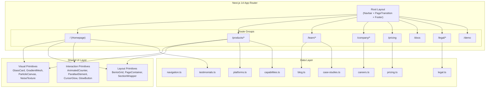
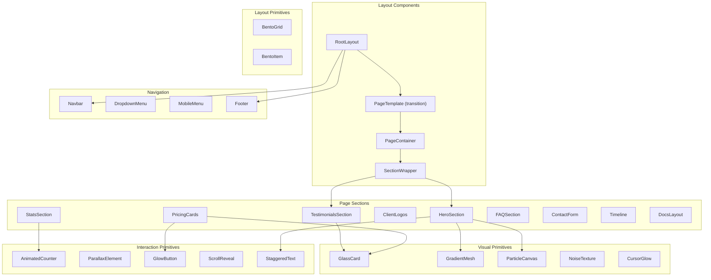

# Design Document: SDA-INT Migration WorkBench Redesign

## Overview

This design transforms the existing single-page SAP PI/PO migration services website into a premium multi-page experience branded "SDA-INT Migration WorkBench." The redesign introduces 20+ content pages, glassmorphism visual effects, gradient mesh backgrounds, animated page transitions, bento grid layouts, particle effects, and micro-interactions — all built on the existing Next.js 14 App Router foundation with Tailwind CSS and Framer Motion.

The architecture preserves the current component-based structure (Navbar, HeroSection, sections, Footer) while extending it with a shared layout system, route-level page transitions, reusable visual effect primitives, and a scalable data layer for multi-page content.

### Design Principles

1. **Progressive Enhancement** — Visual effects (particles, parallax, glassmorphism) degrade gracefully; core content is always accessible
2. **Performance Budget** — LCP ≤ 2.5s, CLS ≤ 0.1; heavy animations lazy-loaded below the fold
3. **Accessibility-First** — Reduced motion respected globally, WCAG AA contrast maintained, semantic HTML
4. **Composable Primitives** — Small, reusable visual building blocks (GlassCard, GradientMesh, ParticleCanvas) composed into page layouts

---

## Architecture

### High-Level System Diagram



### Route Structure

```
src/app/
├── layout.tsx                    # Root layout (brand meta, font, JSON-LD, skip-link)
├── template.tsx                  # Page transition wrapper (AnimatePresence)
├── page.tsx                      # Homepage
├── products/
│   ├── layout.tsx                # Products shared layout (optional breadcrumbs)
│   ├── dell-boomi/page.tsx
│   ├── informatica/page.tsx
│   ├── mulesoft/page.tsx
│   └── assessment/page.tsx
├── learn/
│   ├── blog/page.tsx
│   ├── case-studies/page.tsx
│   ├── webinars/page.tsx
│   └── documentation/page.tsx
├── company/
│   ├── about/page.tsx
│   ├── careers/page.tsx
│   ├── contact/page.tsx
│   └── partners/page.tsx
├── pricing/page.tsx
├── docs/page.tsx
├── legal/
│   ├── privacy/page.tsx
│   ├── terms/page.tsx
│   └── cookies/page.tsx
└── demo/page.tsx
```

---

## Components and Interfaces

### Component Hierarchy



### Low-Level Component Specifications

#### 1. PageTemplate (Page Transition Wrapper)

**File:** `src/app/template.tsx`

```typescript
"use client";

import { motion, useReducedMotion } from "framer-motion";
import { ReactNode } from "react";

interface PageTemplateProps {
  children: ReactNode;
}

const pageVariants = {
  initial: { opacity: 0, y: 20 },
  animate: { opacity: 1, y: 0 },
  exit: { opacity: 0, y: -20 },
};

const pageTransition = {
  duration: 0.4,
  ease: [0.25, 0.46, 0.45, 0.94], // ease-out-quad
};

export default function PageTemplate({ children }: PageTemplateProps) {
  const prefersReducedMotion = useReducedMotion();

  if (prefersReducedMotion) {
    return <>{children}</>;
  }

  return (
    <motion.div
      initial="initial"
      animate="animate"
      exit="exit"
      variants={pageVariants}
      transition={pageTransition}
    >
      {children}
    </motion.div>
  );
}
```

#### 2. GlassCard

**File:** `src/components/ui/GlassCard.tsx`

```typescript
"use client";

import { motion, useReducedMotion } from "framer-motion";
import { ReactNode } from "react";

export interface GlassCardProps {
  children: ReactNode;
  className?: string;
  /** Backdrop blur intensity in px (8-20) */
  blur?: number;
  /** Background opacity percentage (60-80) */
  opacity?: number;
  /** Enable hover scale and glow animation */
  interactive?: boolean;
  /** Render as a specific HTML element */
  as?: "div" | "article" | "section";
}

export function GlassCard({
  children,
  className = "",
  blur = 12,
  opacity = 70,
  interactive = false,
  as: Component = "div",
}: GlassCardProps) {
  const prefersReducedMotion = useReducedMotion();

  const baseStyles = `
    relative rounded-2xl
    bg-surface/${opacity}
    backdrop-blur-[${blur}px]
    border border-white/10
    overflow-hidden
  `;

  if (!interactive || prefersReducedMotion) {
    return (
      <Component className={`${baseStyles} ${className}`}>
        {children}
      </Component>
    );
  }

  return (
    <motion.div
      className={`${baseStyles} ${className}`}
      whileHover={{ scale: 1.02 }}
      transition={{ duration: 0.25 }}
    >
      {/* Animated gradient border on hover */}
      <div className="absolute inset-0 rounded-2xl opacity-0 hover:opacity-100 transition-opacity duration-300 pointer-events-none bg-gradient-to-r from-accent-primary/20 via-accent-secondary/20 to-accent-primary/20 bg-[length:200%_100%] animate-gradient-shift" />
      {children}
    </motion.div>
  );
}
```

#### 3. GradientMesh

**File:** `src/components/ui/GradientMesh.tsx`

```typescript
"use client";

import { motion, useReducedMotion } from "framer-motion";

export interface GradientMeshProps {
  /** Color stops for the mesh gradient */
  colors?: [string, string] | [string, string, string];
  /** Opacity of the gradient (5-15%) */
  opacity?: number;
  /** Whether orbs should animate (drift/pulse) */
  animated?: boolean;
  className?: string;
}

export function GradientMesh({
  colors = ["#6366F1", "#06B6D4"],
  opacity = 10,
  animated = true,
  className = "",
}: GradientMeshProps) {
  const prefersReducedMotion = useReducedMotion();
  const shouldAnimate = animated && !prefersReducedMotion;

  return (
    <div
      className={`absolute inset-0 overflow-hidden pointer-events-none ${className}`}
      aria-hidden="true"
    >
      {/* Primary orb */}
      <motion.div
        className="absolute w-[600px] h-[600px] rounded-full"
        style={{
          background: `radial-gradient(circle, ${colors[0]}${Math.round(opacity * 2.55).toString(16).padStart(2, '0')} 0%, transparent 70%)`,
          top: "10%",
          left: "20%",
        }}
        animate={shouldAnimate ? {
          x: [0, 30, -20, 0],
          y: [0, -20, 15, 0],
          scale: [1, 1.05, 0.95, 1],
        } : undefined}
        transition={shouldAnimate ? {
          duration: 12,
          repeat: Infinity,
          ease: "easeInOut",
        } : undefined}
      />
      {/* Secondary orb */}
      <motion.div
        className="absolute w-[500px] h-[500px] rounded-full"
        style={{
          background: `radial-gradient(circle, ${colors[1]}${Math.round(opacity * 2.55).toString(16).padStart(2, '0')} 0%, transparent 70%)`,
          bottom: "10%",
          right: "15%",
        }}
        animate={shouldAnimate ? {
          x: [0, -25, 15, 0],
          y: [0, 20, -10, 0],
          scale: [1, 0.95, 1.05, 1],
        } : undefined}
        transition={shouldAnimate ? {
          duration: 10,
          repeat: Infinity,
          ease: "easeInOut",
        } : undefined}
      />
    </div>
  );
}
```

#### 4. ParticleCanvas

**File:** `src/components/ui/ParticleCanvas.tsx`

```typescript
"use client";

import { useEffect, useRef, useCallback } from "react";
import { useReducedMotion } from "framer-motion";

export interface ParticleCanvasProps {
  /** Number of particles */
  count?: number;
  /** Particle color */
  color?: string;
  /** Whether particles follow cursor */
  cursorInteractive?: boolean;
  className?: string;
}

interface Particle {
  x: number;
  y: number;
  vx: number;
  vy: number;
  radius: number;
  opacity: number;
}

export function ParticleCanvas({
  count = 50,
  color = "#6366F1",
  cursorInteractive = true,
  className = "",
}: ParticleCanvasProps) {
  const canvasRef = useRef<HTMLCanvasElement>(null);
  const animationRef = useRef<number>(0);
  const mouseRef = useRef({ x: 0, y: 0 });
  const particlesRef = useRef<Particle[]>([]);
  const prefersReducedMotion = useReducedMotion();

  // ... (initialization and animation loop logic)
  // Renders floating particles with optional cursor interaction
  // Uses requestAnimationFrame for smooth 60fps rendering
  // Respects prefers-reduced-motion by rendering static dots

  if (prefersReducedMotion) return null;

  return (
    <canvas
      ref={canvasRef}
      className={`absolute inset-0 pointer-events-none ${className}`}
      aria-hidden="true"
    />
  );
}
```

#### 5. AnimatedCounter

**File:** `src/components/ui/AnimatedCounter.tsx`

```typescript
"use client";

import { useEffect, useRef, useState } from "react";
import { useReducedMotion } from "framer-motion";
import { useInView } from "framer-motion";

export interface AnimatedCounterProps {
  target: number;
  /** Duration of count animation in ms (1500-2500) */
  duration?: number;
  /** Suffix like "+" or "%" */
  suffix?: string;
  /** Prefix like "$" */
  prefix?: string;
  className?: string;
}

export function AnimatedCounter({
  target,
  duration = 2000,
  suffix = "",
  prefix = "",
  className = "",
}: AnimatedCounterProps) {
  const [count, setCount] = useState(0);
  const ref = useRef<HTMLSpanElement>(null);
  const isInView = useInView(ref, { once: true });
  const prefersReducedMotion = useReducedMotion();

  useEffect(() => {
    if (!isInView) return;
    if (prefersReducedMotion) {
      setCount(target);
      return;
    }

    let startTime: number;
    const animate = (currentTime: number) => {
      if (!startTime) startTime = currentTime;
      const progress = Math.min((currentTime - startTime) / duration, 1);
      // Ease-out cubic
      const eased = 1 - Math.pow(1 - progress, 3);
      setCount(Math.floor(eased * target));
      if (progress < 1) {
        requestAnimationFrame(animate);
      }
    };
    requestAnimationFrame(animate);
  }, [isInView, target, duration, prefersReducedMotion]);

  return (
    <span ref={ref} className={className} aria-label={`${prefix}${target}${suffix}`}>
      {prefix}{count}{suffix}
    </span>
  );
}
```

#### 6. BentoGrid

**File:** `src/components/ui/BentoGrid.tsx`

```typescript
import { ReactNode } from "react";

export interface BentoGridProps {
  children: ReactNode;
  /** Number of columns on desktop (2-4) */
  columns?: 2 | 3 | 4;
  className?: string;
}

export interface BentoItemProps {
  children: ReactNode;
  /** Column span (1-3) */
  colSpan?: 1 | 2 | 3;
  /** Row span (1-2) */
  rowSpan?: 1 | 2;
  className?: string;
}

export function BentoGrid({ children, columns = 3, className = "" }: BentoGridProps) {
  const colClass = {
    2: "md:grid-cols-2",
    3: "md:grid-cols-3",
    4: "md:grid-cols-4",
  }[columns];

  return (
    <div className={`grid grid-cols-1 ${colClass} gap-4 md:gap-6 ${className}`}>
      {children}
    </div>
  );
}

export function BentoItem({ children, colSpan = 1, rowSpan = 1, className = "" }: BentoItemProps) {
  const spanClass = `col-span-1 md:col-span-${colSpan} row-span-${rowSpan}`;
  return (
    <div className={`${spanClass} ${className}`}>
      {children}
    </div>
  );
}
```

#### 7. NoiseTexture

**File:** `src/components/ui/NoiseTexture.tsx`

```typescript
export interface NoiseTextureProps {
  /** Opacity of noise overlay (2-5%) */
  opacity?: number;
  className?: string;
}

export function NoiseTexture({ opacity = 3, className = "" }: NoiseTextureProps) {
  return (
    <div
      className={`absolute inset-0 pointer-events-none ${className}`}
      aria-hidden="true"
      style={{
        opacity: opacity / 100,
        backgroundImage: `url("data:image/svg+xml,%3Csvg viewBox='0 0 256 256' xmlns='http://www.w3.org/2000/svg'%3E%3Cfilter id='noiseFilter'%3E%3CfeTurbulence type='fractalNoise' baseFrequency='0.65' numOctaves='3' stitchTiles='stitch'/%3E%3C/filter%3E%3Crect width='100%25' height='100%25' filter='url(%23noiseFilter)'/%3E%3C/svg%3E")`,
      }}
    />
  );
}
```

#### 8. StaggeredText

**File:** `src/components/ui/StaggeredText.tsx`

```typescript
"use client";

import { motion, useReducedMotion } from "framer-motion";

export interface StaggeredTextProps {
  text: string;
  /** Split by "word" or "line" */
  splitBy?: "word" | "line";
  /** Element tag to render */
  as?: "h1" | "h2" | "h3" | "p" | "span";
  className?: string;
  /** Total animation duration in ms (800-1200) */
  duration?: number;
}

export function StaggeredText({
  text,
  splitBy = "word",
  as: Tag = "h1",
  className = "",
  duration = 1000,
}: StaggeredTextProps) {
  const prefersReducedMotion = useReducedMotion();
  const segments = splitBy === "word" ? text.split(" ") : text.split("\n");
  const staggerDelay = (duration / 1000) / segments.length;

  if (prefersReducedMotion) {
    return <Tag className={className}>{text}</Tag>;
  }

  return (
    <Tag className={className} aria-label={text}>
      {segments.map((segment, i) => (
        <motion.span
          key={i}
          className="inline-block"
          initial={{ opacity: 0, y: 20 }}
          animate={{ opacity: 1, y: 0 }}
          transition={{ delay: i * staggerDelay, duration: 0.4, ease: "easeOut" }}
          aria-hidden="true"
        >
          {segment}{splitBy === "word" && i < segments.length - 1 ? "\u00A0" : ""}
        </motion.span>
      ))}
    </Tag>
  );
}
```

#### 9. ParallaxElement

**File:** `src/components/ui/ParallaxElement.tsx`

```typescript
"use client";

import { motion, useScroll, useTransform, useReducedMotion } from "framer-motion";
import { useRef, ReactNode } from "react";

export interface ParallaxElementProps {
  children: ReactNode;
  /** Parallax offset as percentage of scroll (10-30) */
  offset?: number;
  className?: string;
}

export function ParallaxElement({
  children,
  offset = 20,
  className = "",
}: ParallaxElementProps) {
  const ref = useRef<HTMLDivElement>(null);
  const prefersReducedMotion = useReducedMotion();
  const { scrollYProgress } = useScroll({
    target: ref,
    offset: ["start end", "end start"],
  });

  const y = useTransform(scrollYProgress, [0, 1], [`-${offset}%`, `${offset}%`]);

  if (prefersReducedMotion) {
    return <div className={className}>{children}</div>;
  }

  return (
    <motion.div ref={ref} style={{ y }} className={className}>
      {children}
    </motion.div>
  );
}
```

#### 10. Updated Navbar (Brand Rename + Glassmorphism)

The existing Navbar component will be updated to:
- Replace "IntegrationMigrate" with "SDA-INT Migration WorkBench" (full) / "SDA-INT" (mobile)
- Apply glassmorphism style (backdrop-blur-[16px], bg-background/70) when scrolled past 50px
- Keep existing keyboard navigation, focus indicators, and mobile menu

```typescript
// Key change in Navbar.tsx
<Link href="/" className="...">
  <span className="hidden lg:inline">SDA-INT Migration WorkBench</span>
  <span className="lg:hidden">SDA-INT</span>
</Link>

// Glassmorphism when scrolled:
className={`... ${
  isScrolled
    ? "bg-surface/70 backdrop-blur-[16px] border-b border-white/10"
    : "bg-transparent border-b border-transparent"
}`}
```

#### 11. Updated Footer (Complete Navigation)

```typescript
export interface FooterLinkGroup {
  title: string;
  links: { label: string; href: string }[];
}

export const footerLinks: FooterLinkGroup[] = [
  {
    title: "Products",
    links: [
      { label: "Dell Boomi", href: "/products/dell-boomi" },
      { label: "Informatica", href: "/products/informatica" },
      { label: "MuleSoft", href: "/products/mulesoft" },
      { label: "Assessment", href: "/products/assessment" },
    ],
  },
  {
    title: "Learn",
    links: [
      { label: "Blog", href: "/learn/blog" },
      { label: "Case Studies", href: "/learn/case-studies" },
      { label: "Webinars", href: "/learn/webinars" },
      { label: "Documentation", href: "/learn/documentation" },
    ],
  },
  {
    title: "Company",
    links: [
      { label: "About", href: "/company/about" },
      { label: "Careers", href: "/company/careers" },
      { label: "Contact", href: "/company/contact" },
      { label: "Partners", href: "/company/partners" },
    ],
  },
  {
    title: "Legal",
    links: [
      { label: "Privacy", href: "/legal/privacy" },
      { label: "Terms", href: "/legal/terms" },
      { label: "Cookies", href: "/legal/cookies" },
    ],
  },
];
```

#### 12. CursorGlow (Hero Interaction)

**File:** `src/components/ui/CursorGlow.tsx`

```typescript
"use client";

import { motion, useMotionValue, useReducedMotion } from "framer-motion";
import { useEffect, MouseEvent as ReactMouseEvent } from "react";

export interface CursorGlowProps {
  /** Glow radius in px */
  radius?: number;
  /** Glow color */
  color?: string;
  className?: string;
}

export function CursorGlow({
  radius = 200,
  color = "#6366F1",
  className = "",
}: CursorGlowProps) {
  const x = useMotionValue(0);
  const y = useMotionValue(0);
  const prefersReducedMotion = useReducedMotion();

  if (prefersReducedMotion) return null;

  const handleMouseMove = (e: ReactMouseEvent<HTMLDivElement>) => {
    const rect = e.currentTarget.getBoundingClientRect();
    x.set(e.clientX - rect.left);
    y.set(e.clientY - rect.top);
  };

  return (
    <div className={`relative ${className}`} onMouseMove={handleMouseMove}>
      <motion.div
        className="absolute pointer-events-none rounded-full"
        style={{
          x,
          y,
          width: radius,
          height: radius,
          marginLeft: -radius / 2,
          marginTop: -radius / 2,
          background: `radial-gradient(circle, ${color}20 0%, transparent 70%)`,
        }}
        aria-hidden="true"
      />
    </div>
  );
}
```

---

## Data Models

### Navigation Data (Updated)

```typescript
// src/data/navigation.ts - Updated structure
export interface DropdownItem {
  label: string;
  href: string;
  description?: string;
  icon?: string; // Lucide icon name
}

export interface NavItem {
  label: string;
  href?: string;
  dropdown?: DropdownItem[];
}

// Top-level: Products, Learn, Docs, Company, Pricing
export const navigationItems: NavItem[] = [/* ... as existing ... */];
```

### Pricing Data

```typescript
// src/data/pricing.ts
export interface PricingTier {
  id: string;
  name: string;
  price: string;             // "$X,XXX" or "Custom"
  period: string;            // "per project" | "per month"
  description: string;
  features: string[];
  highlighted: boolean;      // "Popular" badge
  ctaLabel: string;
  ctaHref: string;
}

export interface FAQ {
  question: string;
  answer: string;
}

export const pricingTiers: PricingTier[] = [/* ... */];
export const pricingFAQs: FAQ[] = [/* ... */];
```

### Testimonials Data

```typescript
// src/data/testimonials.ts
export interface Testimonial {
  id: string;
  quote: string;
  authorName: string;
  authorTitle: string;
  company: string;
  companyLogo?: string;    // Path to logo SVG
}

export interface Stat {
  id: string;
  label: string;
  value: number;
  suffix?: string;         // "+", "%", "K"
  prefix?: string;         // "$"
}

export const testimonials: Testimonial[] = [/* ... */];
export const stats: Stat[] = [/* ... */];
export const clientLogos: { name: string; src: string }[] = [/* ... */];
```

### Blog / Case Studies Data

```typescript
// src/data/blog.ts
export interface BlogPost {
  slug: string;
  title: string;
  excerpt: string;
  publishedDate: string;   // ISO date string
  category: string;
  tags: string[];
  readTimeMinutes: number;
}

// src/data/case-studies.ts
export interface CaseStudy {
  slug: string;
  company: string;
  industry: string;
  platform: "dell-boomi" | "informatica" | "mulesoft";
  metrics: { label: string; value: string }[];
  excerpt: string;
  logoSrc?: string;
}
```

### Webinars Data

```typescript
// src/data/webinars.ts
export interface Webinar {
  id: string;
  title: string;
  date: string;           // ISO date
  duration: string;       // "45 min"
  status: "upcoming" | "recorded";
  registrationUrl?: string;
  playbackUrl?: string;
  description: string;
}
```

### Careers Data

```typescript
// src/data/careers.ts
export interface JobPosting {
  id: string;
  title: string;
  department: string;
  location: string;
  type: "full-time" | "contract";
  description: string;
  applyUrl: string;
}

export interface Benefit {
  icon: string;
  title: string;
  description: string;
}
```

### Legal Content

```typescript
// src/data/legal.ts
export interface LegalPage {
  slug: "privacy" | "terms" | "cookies";
  title: string;
  lastUpdated: string;     // ISO date
  sections: {
    heading: string;
    content: string;       // Markdown or plain text
  }[];
}
```

### Platform-Specific Data (Extended)

```typescript
// src/data/platforms.ts - Extended
export interface PlatformDetail extends Platform {
  heroTagline: string;
  capabilities: {
    title: string;
    description: string;
    icon: string;
  }[];
  comparisonFeatures: {
    feature: string;
    before: string;
    after: string;
  }[];
}
```

---

## Error Handling

### Strategy

| Scenario | Handling |
|----------|----------|
| Animation component fails to load | `dynamic()` with fallback returning static layout |
| Canvas context unavailable (ParticleCanvas) | Return null; section renders without particles |
| Reduced motion preference | Global check disables all animations; content remains accessible |
| Image load failure | Next.js `<Image>` with `placeholder="blur"` and fallback alt text |
| Route not found (404) | Custom `/not-found.tsx` page with brand styling |
| Font load delay | `display: "swap"` ensures text visible during font load |
| Large viewport overflow | `max-w-[1280px]` container prevents layout breaks |
| Mobile viewport content overflow | Responsive classes ensure no horizontal scroll |

### Error Boundary Pattern

```typescript
// src/components/ErrorBoundary.tsx
"use client";

import { Component, ReactNode } from "react";

interface Props {
  children: ReactNode;
  fallback?: ReactNode;
}

interface State {
  hasError: boolean;
}

export class ErrorBoundary extends Component<Props, State> {
  state: State = { hasError: false };

  static getDerivedStateFromError(): State {
    return { hasError: true };
  }

  render() {
    if (this.state.hasError) {
      return this.props.fallback ?? null;
    }
    return this.props.children;
  }
}
```

### Dynamic Import with Fallback

```typescript
const ParticleCanvas = dynamic(
  () => import("@/components/ui/ParticleCanvas").then(m => m.ParticleCanvas),
  { ssr: false, loading: () => null }
);
```

---

## Testing Strategy

### Why Property-Based Testing Does NOT Apply

This feature is primarily concerned with:
- **UI rendering and layout** — glassmorphism cards, gradient meshes, particle effects, bento grids
- **Page routing and navigation** — multi-page structure with animated transitions
- **Visual design** — animations, micro-interactions, typography, responsive breakpoints
- **Content pages** — static marketing content for blog, careers, legal, etc.

None of these involve pure functions with large input spaces where universal properties hold. There are no parsers, serializers, data transformations, or algorithmic logic to validate with property-based testing.

### Testing Approach

#### 1. Unit Tests (Vitest + React Testing Library)

- **Component rendering**: Verify each UI component renders correct structure and content
- **Brand rename**: Assert "SDA-INT Migration WorkBench" appears in correct locations
- **Accessibility**: Test keyboard navigation, focus order, ARIA attributes, skip-link
- **Reduced motion**: Test that animations are disabled when `prefers-reduced-motion: reduce`
- **Responsive behavior**: Test mobile menu toggle, layout class changes at breakpoints
- **Data layer**: Verify data files export correct types and content

#### 2. Visual Regression Tests (Playwright)

- Screenshot comparison for glassmorphism cards, gradient meshes, and bento grids
- Mobile vs. desktop layout validation
- Dark theme consistency across pages
- Typography hierarchy verification

#### 3. Integration Tests (Playwright)

- **Navigation**: Click each nav item → verify correct page renders at expected URL
- **Page transitions**: Navigate between routes → verify no layout shift (CLS check)
- **Footer links**: All footer links resolve to valid pages
- **Contact form**: Submit form → verify validation and success state
- **SEO metadata**: Each page has unique title, meta description, OG tags

#### 4. Performance Tests (Lighthouse CI)

- LCP ≤ 2.5s on homepage and product pages
- CLS ≤ 0.1 across all pages
- Verify lazy-loading of below-fold components
- Verify static generation (SSG) output for all marketing pages

#### 5. Accessibility Tests (axe-core + Playwright)

- WCAG AA contrast ratios on all glassmorphism surfaces
- Heading hierarchy validation per page
- Focus indicator visibility (2px accent ring)
- No flashing content > 3 flashes/second
- Skip-to-content link functionality

---

## Implementation Notes

### Tailwind Configuration Extensions

```typescript
// Additional keyframes and animations for tailwind.config.ts
keyframes: {
  "gradient-shift": {
    "0%": { backgroundPosition: "0% 50%" },
    "50%": { backgroundPosition: "100% 50%" },
    "100%": { backgroundPosition: "0% 50%" },
  },
  "float": {
    "0%, 100%": { transform: "translateY(0)" },
    "50%": { transform: "translateY(-10px)" },
  },
},
animation: {
  "gradient-shift": "gradient-shift 3s ease infinite",
  "float": "float 6s ease-in-out infinite",
},
```

### Performance Optimizations

1. **Code Splitting**: Each page route is automatically code-split by Next.js App Router
2. **Dynamic Imports**: ParticleCanvas, heavy animation components loaded with `dynamic({ ssr: false })`
3. **Image Optimization**: Use `next/image` with responsive sizes and lazy loading
4. **Static Generation**: All pages use `export const dynamic = "force-static"` or default SSG
5. **Font Loading**: Inter loaded via `next/font` with `display: "swap"` — no FOIT

### Accessibility Implementation Checklist

- [ ] Skip-to-content link on every page (already in root layout)
- [ ] `prefers-reduced-motion` respected by all animated components
- [ ] Semantic heading hierarchy (h1 → h2 → h3) on every page
- [ ] Visible focus rings (ring-2 ring-accent-primary) on all interactive elements
- [ ] ARIA labels on decorative canvases (`aria-hidden="true"`)
- [ ] Color contrast ≥ 4.5:1 on glassmorphism surfaces (verified in design tokens)
- [ ] Touch targets ≥ 44×44px on mobile
